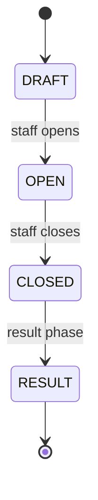
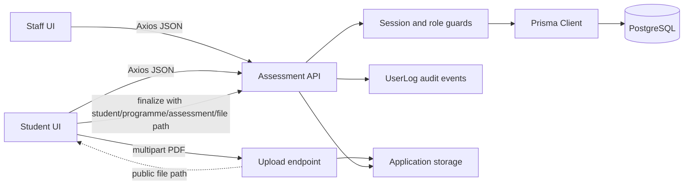

# Assessment Workflow

## BRS

The redesigned feature lets authorised staff create programme-owned assessments, manage the lifecycle `DRAFT -> OPEN -> CLOSED -> RESULT`, review submissions, grade them, and publish results. Students can view assessments for their programme, submit or resubmit work according to the deadline, extended deadline, and staff-configured resubmission limit, and view their own published results. Fee status controls whether a result is published or placed on hold.

Attendance, scheduling, notifications, reporting, and transcripts are outside this feature boundary. Resubmissions, extended deadlines, and PDF upload handling are part of this feature.

## SRS and data model

- `Assessment` stores title, programme, module name, deadline, optional extended deadline, total marks, highest grade, author, resubmission limit, lifecycle status, and timestamps.
- `StudentAssessment` stores the student/assessment relationship, marks, grade, result status, submission status, submitted time, and resubmission count.
- `AssessmentSubmission.file_path` stores the public path returned by the file uploader. Resubmission replaces this path and replaces the existing stored file.
- Result status is `PENDING`, `IN_PROGRESS`, `ON_HOLD`, or `PUBLISHED`; `ON_HOLD` is used when fee dues prevent publication.
- Foreign keys use `RESTRICT`; indexes support programme/status/deadline, author/status, student history, and published-result visibility.
- Decimal values cross the API as strings. File upload is a two-step boundary: upload first, then finalize the submission with the returned public path. Submission finalization cross-checks `student_id`, `programme_id`, `assessment_id`, and `file_path`.

## API and UI boundaries

The UI pages are `/dashboard/assessments` for staff and `/student/assessments` for students. Shared orchestration lives in `components/feature/assessment/assessment-page.tsx`; forms live in `components/forms/assessment-forms.tsx`. All calls use the existing Axios instance and read successful values from `response.data.data`.

| Method | Path | Boundary |
| --- | --- | --- |
| GET | `/api/assessments` | Authenticated catalogue; students receive non-draft assessments for their programme |
| POST | `/api/assessments` | Staff creates a draft for an active programme |
| GET/PATCH | `/api/assessments/:id` | Safe detail; author/elevated staff edit drafts and transition lifecycle |
| GET/POST | `/api/submissions` | Student submission/resubmission or staff review; deadline and resubmission rules apply |
| POST | `/api/submissions/file-upload` | Authenticated multipart PDF upload; returns a public file path |
| GET/POST | `/api/results` | Published student results or staff grading/review |
| PATCH | `/api/results/:id` | Staff publishes a graded result |

## Security and privacy

Authentication and role guards protect every route. Students are checked against their linked profile and programme for assessment access and submission ownership. Results queried by students always include `isPublished = true`; staff-only fields, credentials, passwords, OTP data, storage secrets, and attachment contents are excluded from projections. Writes create audit `UserLog` events with internal IDs only.

Validation rejects malformed identifiers, dates, filters, negative or malformed marks, marks above `maxMarks`, invalid PDF files, oversized files, invalid filenames, mismatched student/programme/assessment/file-path values, and exceeded resubmission limits. Conflict responses distinguish invalid lifecycle, non-editable assessments, closed assessments, deadlines, resubmission limits, excessive marks, fee holds, and already-published results.

## High-level data flow

## Migration and validation

The application lifecycle is implemented in `lib/assessments.ts`, but `prisma/schema.prisma` still has the earlier `PUBLISHED` enum and lacks the planned extended deadline, resubmission, result status, and `file_path` alignment. The schema migration and generated client must be updated before deployment. Local migration application also requires the configured PostgreSQL host to be reachable.

The focused route contract suite covers draft creation, publish/close lifecycle, staff ownership, programme/deadline submission checks, duplicate submissions, student unpublished-result privacy, grade bounds, malformed marks, result publication, and decimal-safe output. Browser tests are optional for this handoff because the repository Jest setup is Node-based and has no component transform/root configuration.

## Known limitations

The current repository upload route writes directly to a public local directory and returns a public path, which is the intended contract for this design but still needs stronger PDF, size, filename, and failure handling. The page currently uses local Axios/state; the assessment Redux thunks and slice exist but are not yet the page source of truth. Resubmission replacement must preserve the previous file until the replacement succeeds.