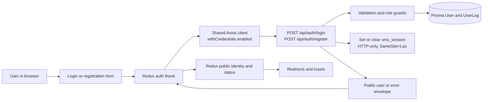
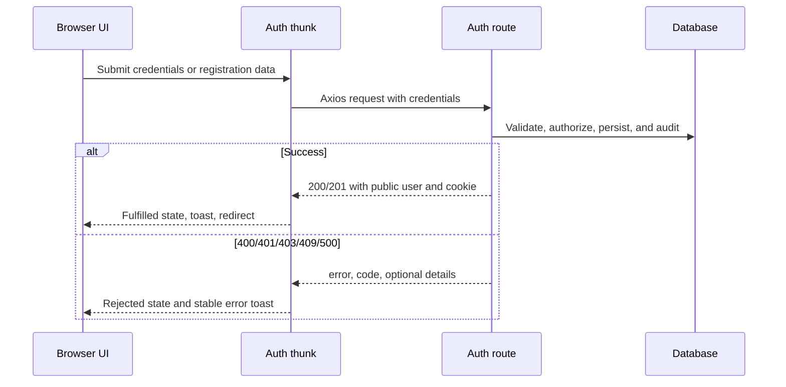

# Authentication and Authorization Stabilization

## Scope

This feature connects the login and registration UI to the canonical `/api/auth/*` routes. The API owns validation, password hashing, role checks, audit logging, and the `sms_session` HTTP-only cookie. The UI owns form validation, Redux public-user state, navigation, and toast feedback.

## Data Flow

## Boundaries

- API success responses are read from `response.data.user`; login accepts `200` and registration accepts `201`.
- Public user state contains only `id`, `email`, `name`, and `role`. Passwords, password hashes, session tokens, and raw responses are not stored in Redux.
- API errors retain `error`, `code`, and optional `details`. The UI displays the first field validation detail when available, then the API message, with a retryable fallback for unknown failures.
- Registration is admin-only at the API boundary. The public signup page directs visitors to an administrator instead of presenting a role-selection form.

## Session Lifecycle

1. A successful login signs a seven-day `sms_session` cookie with `httpOnly`, `SameSite=Lax`, and `/` path attributes.
2. The shared Axios client sends credentials on auth requests, preserving the cookie-backed session in browser and hosted deployments.
3. Server components and `/api/auth/me` verify the signed cookie and reload the active user from Prisma.
4. The dashboard redirects to `/login` when no valid active session exists.
5. Logout clears the cookie and is idempotent for missing or invalid sessions.

## Error Flow

## Validation Coverage

- Focused authentication tests: `npm test -- --runInBand app/authentication-ui.test.ts app/api/auth/login/route.test.ts app/api/auth/register/route.test.ts app/api/auth/logout/route.test.ts app/api/auth/me/route.test.ts`
  - Result: 5 suites passed, 42 tests passed.
- The route tests cover success envelopes, public-field privacy, validation, invalid credentials, insufficient role, authorization, duplicate email, logout, session lookup, and internal errors.
- UI Redux tests cover the `201` registration contract, login public-user state, validation detail rendering, and password privacy.
- No Playwright suite exists in the repository and the Playwright package is not installed, so a new browser test was not added during this integration pass.

## Integration Status

- Axios credential transport: enabled in `lib/axios-client.ts`.
- Live dashboard probe: blocked by the local Next runtime. Turbopack cannot load native bindings in this environment; the Webpack fallback encounters a permission error in the existing root-owned `.next/dev/cache`.
- Browser login, registration, cookie persistence, logout, and toast observations therefore remain pending a writable build cache and an installed browser automation runner.