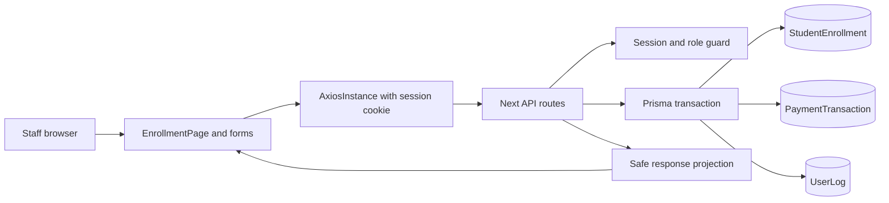

# Enrolment and Fee Management

## BRS summary

Staff need a reliable workflow to enrol an eligible student on an active programme, track the enrolment lifecycle, see the fee balance and overdue state, and record internal payments. Registrar and Admin users can perform financial writes; all signed-in staff can read staff-safe projections. Payment history is an immutable ledger.

This feature does not include provider checkout, refunds, voids, notifications, attendance, assessments, or staff administration.

## SRS summary

- Create an enrolment from a unique reference, student, active programme, academic year, and optional due date.
- Snapshot the programme fee at creation time after applying the capped discount.
- Read and filter enrolments by status, inspect one enrolment, and list its payments.
- Transition an active enrolment to `COMPLETED` or `CANCELLED` subject to payment and terminal-state rules.
- Record positive, two-decimal internal payments with unique references and idempotency keys.
- Return money as decimal strings and expose only safe student, programme, lifecycle, balance, and ledger metadata.
- Surface authentication, authorization, validation, not-found, conflict, and persistence errors at the API and UI boundaries.

## Data model

`StudentEnrollment` stores the student/programme/year uniqueness key, unique reference, lifecycle status, fee snapshot (`Decimal(12,2)`), due date, creator, and timestamps. `PaymentTransaction` stores an immutable amount, currency, payment date, unique reference, unique idempotency key, enrolment, and receiving staff member. Financial foreign keys use `RESTRICT`. `UserLog` records creation, lifecycle, and payment events.

The additive migration is `prisma/migrations/20260817150000_enrolment_fee_ledger/migration.sql` and the Prisma model is in `prisma/schema.prisma`.

## Financial rules

- `feeTotal = max(0, fee - min(discount, discountLimit))`; a null limit means the full discount applies.
- Fee snapshots are computed in integer cents and stored as two-decimal decimals, avoiding binary floating-point arithmetic.
- Payments must be positive and have at most two decimal places.
- `balance = feeTotal - sum(payments)` and all projected money fields are strings.
- `overdue` is true only for a positive balance with a due date before the current time.
- Only `ACTIVE` enrolments accept payments.
- Paid enrolments cannot be cancelled; cancelled enrolments cannot be reactivated.
- Payment creation and the balance check run inside one Prisma interactive transaction. Unique database constraints protect references and idempotency keys under retries; deployment should verify the database transaction isolation/locking policy for concurrent overpayment attempts.

## API/UI boundary

The UI uses `AxiosInstance` with `withCredentials` and reads the `{ data: ... }` envelope:

- `GET/POST /api/enrollments`
- `GET/PATCH /api/enrollments/:id`
- `GET /api/fees/:enrollmentId`
- `GET/POST /api/payments`

The UI sends numeric identifiers as numbers, dates as ISO values, and payment amounts unchanged as strings. It keeps the generated idempotency key available across an unsuccessful payment request and maps `409` codes such as `OVERPAYMENT`, `IDEMPOTENCY_CONFLICT`, `ENROLLMENT_NOT_PAYABLE`, and `ENROLLMENT_HAS_PAYMENTS` to distinct messages. It performs no client-side financial arithmetic.

## High-level data flow

## Idempotency and transaction assumptions

A payment replay with the same idempotency key, reference, enrolment, and amount returns the original payment with HTTP `200` and `replay: true`. Reusing the key with different payment data returns `409 IDEMPOTENCY_CONFLICT`. A different reference conflicts with `409 PAYMENT_EXISTS`. Payment rows have no update or delete endpoint.

The application checks the current aggregate and creates the payment in the same Prisma interactive transaction. The database must be reachable and configured with the migration before these guarantees can be exercised against PostgreSQL; operational deployment should also confirm serialization behavior for simultaneous payments against the same enrolment.

## Verification

Focused route contract tests cover:

- enrolment creation and decimal fee snapshotting
- list filter validation and unauthenticated reads
- detail balance projection
- lifecycle update and audit logging
- paid-enrolment cancellation rejection
- payment validation, positive amounts, decimal string output, overpayment, closed enrolments, duplicate/idempotent replay, idempotency conflict, and write authorization
- fee balance and overdue projection

The browser E2E suite is optional for this handoff and was not required to validate the route contracts.

## Provider and migration blockers

No external payment provider is part of this feature. PostgreSQL migration application remains an environment blocker when the configured database service is unavailable at `db:5432`; run `npx prisma migrate deploy` after the service is reachable. This does not invalidate mocked route-contract validation, but database-backed integration and end-to-end verification remain pending until migration deployment succeeds.
