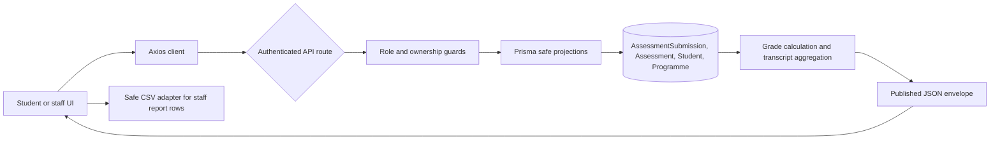

# Grades, Transcripts, and Reporting

## BRS Summary

Students can view only published results belonging to their own active student profile and can request a published transcript with an explicit completion state. Authorized staff can review published result rows, filter and paginate them, request a student's published transcript, and export the visible report rows as CSV. Unpublished results, internal credentials, attachment metadata, and unrelated administration workflows remain outside this feature.

## SRS Summary

The feature uses the `AssessmentSubmission` record as the sole authority for per-assessment marks and publication state.

- `GET /api/results` returns published result rows. Students are forced to their own student ID; staff may filter by `programmeId` and `studentId`.
- `GET /api/transcripts` returns `{ data: { student, status, summary, results } }`. Students cannot select another student; staff must provide `studentId`.
- `GET /api/reports/results` is staff-only and returns the same paginated published result contract as `/api/results`.
- Result and report lists return `{ data, pagination }`, with `page` defaulting to 1, `pageSize` defaulting to 20, and a maximum page size of 100.
- Decimal marks, maximum marks, totals, and percentages are returned as strings.

## Calculation Rules

Percentage is calculated as `marks / maxMarks * 100`, rounded to two decimal places and formatted with exactly two decimal places. Classification is derived at read time and does not trust the nullable stored classification:

- `A`: 80-100
- `B`: 70-79.99
- `C`: 60-69.99
- `D`: 50-59.99
- `F`: below 50

Marks are non-negative decimal strings with at most two decimal places and cannot exceed the assessment maximum. A transcript is `NO_RESULTS` when no published rows exist, `INCOMPLETE` when fewer published programme assessments have results than expected, and `COMPLETE` otherwise. Ungraded or unpublished assessments are not fabricated as zeroes.

## Data Dependencies

The read APIs use `AssessmentSubmission`, `Assessment`, `Programme`, and `Student`. Transcript completion also counts published assessments for the student's programme. `AssessmentSubmission.resultStatus = 3` and `isPublished = true` remain the visibility gate.

## API and UI Boundaries

The API owns grade calculation, classification, aggregation, filtering, pagination, authorization, and safe Prisma projections. The UI consumes the Axios response envelopes, displays decimal strings without recalculation, filters unexpected unpublished rows defensively, exposes explicit loading/error/empty/incomplete states, and keeps staff filters separate from student views. The student results and transcript routes share the student-mode feature surface; the staff report route uses staff mode.

## Authorization and Privacy

Authentication is required for all three GET endpoints. Students require a linked active profile and may read only their own published rows. A student selecting another transcript returns `403 FORBIDDEN`; a missing profile returns `404 STUDENT_NOT_FOUND`. Staff transcript requests require `studentId`, and the report endpoint requires a staff role. Invalid query values return `400 VALIDATION_ERROR`; unexpected failures return `500 INTERNAL_ERROR`.

Public result projections include IDs, assessment and subject names, student UID/name, programme name, marks, maximum marks, derived percentage/classification, and grading/publication timestamps. They do not include password hashes, session or OTP data, attachment metadata, or grader credentials.

## Export Boundary

CSV export is a client adapter over the already authorized report response in memory. It includes only student UID/name, programme, assessment, subject, marks, maximum marks, percentage, classification, and grading/publication timestamps. Values containing CSV delimiters are quoted, and values beginning with `=`, `+`, `-`, or `@` are prefixed to prevent spreadsheet formula execution. No PDF provider, signed URL, export job, or file persistence is introduced.

## Test Coverage

Focused tests cover:

- Grade percentage rounding and classification bands.
- Successful grade response flattening and derived classification.
- Student-owned published result visibility and safe projections.
- Student cross-profile transcript denial and missing-profile behavior.
- Staff-only reporting and required staff transcript selectors.
- Incomplete transcript status and aggregate values.
- Programme/student filters, pagination, and malformed query rejection.
- CSV quoting, decimal-string preservation, safe field selection, and formula neutralization.
- Existing assessment publication and grading regression behavior.

The focused feature suite passes 22 tests. Browser/Playwright tests are optional for this phase and were not required for the contract validation.

## Known Blockers and Limitations

The local environment has four unapplied existing migrations; this feature does not add another migration. Full Jest has one unrelated pre-existing authentication/me failure caused by an outdated Prisma select expectation. The development server runner previously terminated its output stream, so browser validation is not treated as a completion blocker. Final verification passed typecheck and Prisma validate/generate; lint remains blocked by a pre-existing React hooks diagnostic in `components/feature/grades/grades-page.tsx`.

## High-Level Data Flow

