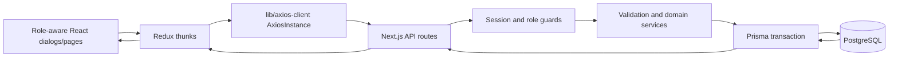

# Feature Improvement Fix V1 — Canonical BRS, SRS, and API Specification

## 1. Business requirements specification (BRS)

### 1.1 Business requirements and acceptance criteria

| ID | Requirement | Acceptance criteria |
| --- | --- | --- |
| BR-1 | Protect identities and role boundaries. | Password hashes, OTP hashes, and session tokens are never returned; API guards, not navigation, enforce access; inactive users cannot authenticate. |
| BR-2 | Maintain a staff-managed student and programme registry. | Authorized users can list, create, update, retrieve, and archive records according to the implemented endpoint guards; archive is soft deletion. |
| BR-3 | Make registration an atomic enrolment workflow. | A registrar creates a generated Student ID and an initial enrollment in one transaction; the academic year and enrollment reference are server-derived. |
| BR-4 | Honour programme coupon limits and preserve charges. | A valid discount atomically consumes one coupon use; exhaustion returns `COUPON_EXHAUSTED` with no partial registration; enrollment fee, discount, and total are snapshots. |
| BR-5 | Maintain an immutable payment ledger. | Registrars record positive, non-overpaying payments to active enrollments; idempotent retries replay the original payment; no refund, void, or provider flow is implemented. |
| BR-6 | Support programme-scoped assessment workflow. | Assessment staff create and manage assessments, students submit only eligible published assessments before the deadline, and staff grade then publish results. |
| BR-7 | Provide role-scoped academic records. | Students see only their published programme assessments, submissions, results, and transcript; staff reporting is constrained by its route guard. |

### 1.2 Roles and permissions

| Capability | Student | Staff | Registrar | Admin |
| --- | --- | --- | --- | --- |
| Sign in and view own records | Yes | — | — | — |
| Assessments, submissions, grading, results | View own | Manage | — | Manage |
| Student/programme registry and registration | — | View | Manage | Manage |
| Enrollment, fees, and payments | View own | — | Manage | Manage |
| Create staff/registrar/admin accounts | — | — | — | Yes |

`ADMIN` bypasses allowed-role checks. API guards remain authoritative; navigation is
only a usability layer. The matrix is retained as the product capability matrix:
the endpoint tables below are the canonical record of current enforcement. In
particular, implemented student registry reads require Registrar/Admin, and fees
and enrollments do not currently expose student-scoped endpoints.

## 2. Software requirements specification (SRS)

### 2.1 Functional requirements

| ID | Requirement |
| --- | --- |
| FR-1 | Authenticate staff through `/api/auth/login` and students through the separate student login and OTP lifecycle. |
| FR-2 | Issue signed HTTP-only session cookies on successful staff login, student verification, and student login; clear the cookie on logout. |
| FR-3 | Expose public user fields only from authentication APIs and audit authentication, enrollment, payment, and assessment events. |
| FR-4 | Provide paginated, searchable registry lists and soft archive students/programmes. |
| FR-5 | Validate programme pricing/coupon policy and serialize programme decimal amounts as strings. |
| FR-6 | Create enrollment and registration financial snapshots from the active programme; derive balances from the payment ledger. |
| FR-7 | Enforce payment idempotency, active-enrollment payment, and outstanding-balance limits. |
| FR-8 | Enforce assessment status transitions (`DRAFT → PUBLISHED → CLOSED`), creator/Registrar/Admin management, programme assignment, and submission deadlines. |
| FR-9 | Calculate result classification from marks/max marks and expose only published results to students. |
| FR-10 | Provide a student or staff-requested published-results transcript with complete/incomplete status. |

### 2.2 Nonfunctional requirements

| ID | Requirement |
| --- | --- |
| NFR-1 | Authorization is server-side and every guarded failure is `401` or `403`; client role-aware navigation must not be treated as security. |
| NFR-2 | Mutations that must remain consistent use Prisma transactions, including registration, enrollment creation, payment creation, grading, and audit creation. |
| NFR-3 | API validation uses bounded fields, allowlisted statuses/sorts, positive integer IDs, and structured `400 VALIDATION_ERROR` details. |
| NFR-4 | Registry list pagination defaults to page 1 and 20 items, with a maximum `pageSize` of 100; assessment/report lists also cap page size at 100. |
| NFR-5 | Decimal monetary and mark values that are explicitly converted for public contracts are strings, preventing precision loss in JavaScript clients. |
| NFR-6 | UI state is managed with Redux Toolkit thunks and `lib/axios-client.ts`; successful mutations reload affected list/detail state. |

## 3. API conventions

### 3.1 Transport, identity, and response envelopes

- Routes are JSON under `/api`. Requests with bodies are JSON objects.
- Successful resource routes normally return `{ "data": ... }`; registry list
  routes add `pagination: { page, pageSize, total, totalPages }`. Authentication
  routes return `{ user, message }` or `{ message }`.
- Errors use `{ "error": string, "code"?: string, "details"?: { field: string[] } }`.
  Zod validation failures use `400 VALIDATION_ERROR`; details use dotted field paths.
- Route-specific `404`, `409`, and `429` codes are listed below. Unexpected
  handler failures return `500 INTERNAL_ERROR`.
- Session authentication is cookie-based. The cookie is signed and HTTP-only.
  Session verification also checks that the persisted user is active. Do not put
  passwords, password hashes, OTPs, OTP hashes, or session tokens in responses.
- Roles are numeric: `0 STUDENT`, `1 STAFF`, `2 REGISTRAR`, `3 ADMIN`. `ADMIN`
  bypasses `requireRole` allowed-role checks. “Registrar” below means the
  Registrar/Admin guard; “assessment staff” means Staff/Registrar/Admin.
- Path IDs and applicable filters are positive integers. Dates labelled `date`
  are `YYYY-MM-DD`; datetimes require an ISO-8601 offset.

### 3.2 Value conventions

- `fee`, `discount`, `feeSnapshot`, `discountSnapshot`, `feeTotal`, `amount`,
  balance fields, `maxMarks`, and result `marks` are returned as decimal strings.
  Money accepts numbers or strings only where the request schema says so; payment
  money accepts non-negative values with at most two decimal places and then
  requires an amount greater than zero.
- Programme create/update accepts numeric `fee` and `discount`; public values are
  strings. Coupon counts are integers. A positive discount requires a non-empty
  coupon and `couponLimit >= 1`; discount cannot exceed fee.
- Emails are trimmed, lowercased, valid, and at most 255 characters where bounded.
  Names are trimmed and 1–255 characters. Student IDs/references are bounded as
  shown per endpoint.

## 4. API endpoint specification

### 4.1 Authentication

| Method/path | Authorization | Request fields | Success | Errors/constraints |
| --- | --- | --- | --- | --- |
| `POST /auth/login` | Public; staff+ only | `email`, `password` (non-empty) | `200 {user:{id,email,name,role},message}` and session cookie | `401 INVALID_CREDENTIALS`; `403 INSUFFICIENT_ROLE`; email normalized. |
| `POST /auth/logout` | Public/session optional | None | `200 {message}`; clears cookie | Always logs out if possible; `500` only on handler failure. |
| `GET /auth/me` | Authenticated active user | None | `200 {user:{id,email,name,role,isActive,createdAt}}` | `401 UNAUTHORIZED`. |
| `POST /auth/register` | Admin | `email`, `name` 1–255, `password` 8–128, `role` integer 1/2/3 | `201 {user:{id,email,name,role},message}` | `409 EMAIL_EXISTS`; cannot create a student account here. |
| `POST /auth/student/register` | Public | `email`, `name` 1–255, `studentId` 1–64, `password` 8–128 | `201 {user:{id,email,name,studentId,role,isVerified:false},message}` | `409 IDENTITY_EXISTS`; creates an unverified student user and sends OTP. |
| `POST /auth/student/verify` | Public | `email`, `otp` exactly six digits | `200 {user:{id,email,name,studentId,role,isVerified:true},message}` and session cookie | `400 INVALID_OTP`/`OTP_EXPIRED`; `409 ALREADY_VERIFIED`; `429 OTP_ATTEMPTS_EXCEEDED`. |
| `POST /auth/student/resend` | Public | `email` | `200 {message}` | `404 STUDENT_NOT_FOUND`; `409 ALREADY_VERIFIED`; `429 OTP_RATE_LIMITED`. |
| `POST /auth/student/login` | Public | `email`, `password` non-empty | `200 {user:{id,email,name,studentId,role},message}` and session cookie | `401 INVALID_CREDENTIALS`; `403 ACCOUNT_UNVERIFIED`. |

All paths in this table are prefixed `/api`. OTP-related account events are
audited. OTP verification increments failed attempts and resets OTP fields after
success.

### 4.2 Registry and registration

| Method/path | Authorization | Request/query fields | Success shape | Errors/constraints |
| --- | --- | --- | --- | --- |
| `GET /students` | Registrar | Query: `page`, `pageSize`, `search`, `status`, `programmeId`, `sort` (`studentUid`, `fullName`, `email`, `academicYear`, `createdAt`, `updatedAt`), `order` | `200 {data: Student[],pagination}` | Excludes soft-deleted students; status allowlisted. |
| `POST /students` | Registrar | `studentUid` 1–64, `fullName`, `email`, optional `dateOfBirth`, `academicYear` 1900–3000, `status`, `programmeId`, `userId` | `201 {data: Student}` | Programme must be active; linked user must be STUDENT; `404 PROGRAMME_NOT_FOUND`/`USER_NOT_FOUND`, `409 STUDENT_EXISTS`. |
| `GET /students/:id` | Registrar | Positive path ID | `200 {data: Student}` | `404 STUDENT_NOT_FOUND`. |
| `PATCH /students/:id` | Registrar | Any subset of POST fields | `200 {data: Student}` | Withdrawn student cannot be reactivated: `409 INVALID_STATUS_TRANSITION`. |
| `DELETE /students/:id` | Admin | Positive path ID | `200 {data: Student,message}` | Soft deletes and sets `WITHDRAWN`; `404 STUDENT_NOT_FOUND`. |
| `GET /programmes` | Staff+ | Query: `page`, `pageSize`, `search`, `status`, `sort` (`name`, `fee`, `createdAt`, `updatedAt`), `order` | `200 {data: Programme[],pagination}` | Excludes archived records; public fee/discount are strings. |
| `POST /programmes` | Registrar+ | `name` 1–255, numeric `fee`, numeric `discount` default 0, nullable `coupon`, nullable integer `couponLimit`, `status` | `201 {data: Programme}` | Pricing/coupon rules in §3.2; `409 PROGRAMME_EXISTS`. |
| `GET /programmes/:id` | Staff+ | Positive path ID | `200 {data: Programme}` | `404 PROGRAMME_NOT_FOUND`. |
| `PATCH /programmes/:id` | Registrar+ | Any subset of create fields; final combined record is validated | `200 {data: Programme}` | Archived programme cannot reactivate; `409 INVALID_STATUS_TRANSITION` or `PROGRAMME_EXISTS`. |
| `DELETE /programmes/:id` | Admin | Positive path ID | `200 {data: Programme,message}` | Soft deletes and sets `ARCHIVED`. |
| `POST /student-registrations` | Registrar | Strictly `fullName`, normalized `email`, optional `dateOfBirth`, positive `programmeId` | `201 {data:{student,enrollment}}` | The registration UI labels the programme field `Programme`, displays active programme names, and submits the selected programme ID as `programmeId`. See registration contract below. |

`Student` includes its registry fields and programme summary. `Programme` includes
`id,name,fee,discount,coupon,couponLimit,couponUsed,status,deletedAt,createdAt,
updatedAt`. Input fields not accepted by the schema are rejected for the strict
registration endpoint.

**Registration contract.** The server generates `studentUid` (`STU-…`), current
calendar `academicYear`, and enrollment `reference` (`ENR-…`). In one transaction
it verifies an active, non-deleted programme; validates its stored discount policy;
creates the student; atomically increments `couponUsed` only when a positive
discount applies; and creates an active enrollment with immutable snapshots.
Success returns student `{id,studentUid,fullName,email,academicYear,programmeId,
createdAt}` and enrollment `{id,reference,enrolledYear,feeSnapshot,
discountSnapshot,feeTotal,status,createdAt}`. Snapshot values are strings.
Failures are `404 PROGRAMME_NOT_FOUND`, `409 INVALID_PROGRAMME_DISCOUNT`,
`409 COUPON_EXHAUSTED`, or `409 STUDENT_EXISTS`; all transactional writes roll
back on failure.

### 4.3 Enrollments, fees, and payments

| Method/path | Authorization | Request/query fields | Success shape | Errors/constraints |
| --- | --- | --- | --- | --- |
| `GET /enrollments` | Registrar | Optional positive `studentId`, `status` (`ACTIVE`, `COMPLETED`, `CANCELLED`) | `200 {data: Enrollment[]}` | Each enrollment includes string snapshots/total and `balance:{feeTotal,paid,balance,overdue}`. |
| `POST /enrollments` | Registrar | `reference` 1–64, positive `studentId`, positive `programmeId`, `enrolledYear` 1900–3000, optional `dueDate` | `201 {data: Enrollment}` | Student must be non-deleted/non-withdrawn; programme active; coupon is atomically claimed for a positive discount. `404 STUDENT_NOT_FOUND`/`PROGRAMME_NOT_FOUND`; `409 COUPON_EXHAUSTED`/`ENROLLMENT_EXISTS`. |
| `GET /enrollments/:id` | Registrar | Positive path ID | `200 {data: Enrollment}` | `404 ENROLLMENT_NOT_FOUND`. |
| `PATCH /enrollments/:id` | Registrar | Exactly `status` enum | `200 {data: Enrollment}` | Cancelled enrollment cannot reactivate; paid enrollment cannot cancel: `409 INVALID_STATUS_TRANSITION`/`ENROLLMENT_HAS_PAYMENTS`. |
| `GET /fees/:enrollmentId` | Registrar | Positive path ID | `200 {data:{enrollmentId,feeTotal,paid,balance,overdue}}` | Money fields are strings; `404 ENROLLMENT_NOT_FOUND`. |
| `GET /payments` | Registrar or Student | Optional positive `enrollmentId` | `200 {data: Payment[]}` | Student result is limited to that student's enrollments; a missing identity link is `403 STUDENT_PROFILE_MISSING`. |
| `POST /payments` | Registrar | `reference` 1–64, `idempotencyKey` 1–128, positive `enrollmentId`, `amount`, `currency` 3 chars default `USD`, optional offset datetime `paymentDate` | `201 {data: Payment,replay:false}` or `200 {data: Payment,replay:true}` | See payment contract below. |
| `GET /payments/:id` | Registrar | Positive path ID | `200 {data: Payment}` | `404 PAYMENT_NOT_FOUND`; this detail route is not student-scoped. |

**Payment contract.** The ledger is immutable. The server first compares an existing
`idempotencyKey`: the same key with the same reference, amount, and enrollment
replays the stored payment; different data returns `409 IDEMPOTENCY_CONFLICT`.
For a new payment, the enrollment must exist and be `ACTIVE`; prior paid amount plus
the requested amount cannot exceed `feeTotal`. Failures are `404
ENROLLMENT_NOT_FOUND`, `409 ENROLLMENT_NOT_PAYABLE`, `409 OVERPAYMENT`, or `409
PAYMENT_EXISTS`. A public payment includes `id,reference,idempotencyKey,
enrollmentId,amount` (string), `currency,paymentDate,createdAt,enrollment`; detail
also includes `receivedById`, full enrollment context, and `receivedBy`.

### 4.4 Assessments, submissions, results, reports, and transcripts

| Method/path | Authorization | Request/query fields | Success shape | Errors/constraints |
| --- | --- | --- | --- | --- |
| `GET /assessments` | Any authenticated user | `page`, `pageSize`, optional positive `programmeId`, optional status | `200 {data: Assessment[],pagination}` | Students receive only their programme's `PUBLISHED` assessments. |
| `POST /assessments` | Assessment staff | `title` 1–200, optional nullable `subjectName` max 160, positive `programmeId`, offset `dueDate`, decimal-string `maxMarks` >0 | `201 {data: Assessment}` | Programme active; `404 PROGRAMME_NOT_FOUND`. |
| `GET /assessments/:id` | Any authenticated user | Positive path ID | `200 {data: Assessment}` | Students receive `404` unless it is their programme's published assessment. |
| `PATCH /assessments/:id` | Assessment staff | Partial create fields except `programmeId`, optional `status` | `200 {data: Assessment}` | Creator may manage own assessment; Registrar/Admin any. Only drafts are editable; transitions only draft→published and published→closed. `409 INVALID_STATUS_TRANSITION`/`ASSESSMENT_NOT_EDITABLE`. |
| `GET /submissions` | Any authenticated user | Optional positive `assessmentId` | `200 {data: Submission[]}` | Students are scoped to self; non-students see all matching submissions. |
| `POST /submissions` | Authenticated user with linked student record | `assessmentId`, optional strict `attachmentMetadata:{storageKey,fileName,contentType,sizeBytes}`; size ≤50,000,000 | `201 {data: Submission}` | Must be published, in student's programme, and before due date. `409 ASSESSMENT_NOT_OPEN`/`DEADLINE_PASSED`/`SUBMISSION_EXISTS`. |
| `GET /results` | Any authenticated user | `page`, `pageSize` ≤100, optional positive `programmeId`,`studentId` | `200 {data: Result[],pagination}` | Published only; students are self-scoped. |
| `POST /results` | Assessment staff | `submissionId`, decimal-string `marks`, optional nullable `classification` max 80 | `201 {data: Result}` | `marks` cannot exceed assessment maximum: `409 MARKS_EXCEED_MAX`; one result per submission. |
| `PATCH /results/:id` | Assessment staff | No body fields used | `200 {data:{id,assessmentId,studentId,marks,isPublished,publishedAt}}` | Publishes once; `409 RESULT_ALREADY_PUBLISHED`. |
| `GET /reports/results` | Assessment staff | Same query as `/results` | Same as `/results` | Delegates to results list after the assessment-staff guard. |
| `GET /transcripts` | Any authenticated user | Report query; staff must provide `studentId` | `200 {data:{student,status,summary,results}}` | Student can request only own transcript; published results only; `status` is `NO_RESULTS`, `INCOMPLETE`, or `COMPLETE`. |

Assessment `maxMarks` and result `marks` are public strings. Result responses
calculate `percentage` with two decimal places and classification `A` (≥80), `B`
(≥70), `C` (≥60), `D` (≥50), or `F`. The stored optional classification supplied
on grade creation is not the public calculated classification.

## 5. Data model and migration notes

`User` stores numeric role, password hash, OTP state, session-audited events, and
optional student-authentication `studentId`. `Student` is the registry identity
with generated `studentUid`; `Programme` holds catalogue price/coupon policy;
`StudentEnrollment` stores immutable `feeSnapshot`, `discountSnapshot`, and
`feeTotal`. `PaymentTransaction` is an immutable idempotent ledger. Assessments,
submissions, and results are programme/student scoped.

Migration `20260818055800_coupon_limits_enrollment_snapshots` replaces
`discountLimit` with nullable integer `couponLimit` and non-negative `couponUsed`,
adds their checks/index, and adds nullable enrollment snapshots. Historical
snapshots stay `NULL` because their values cannot be reconstructed safely. New
registration atomically claims a coupon with `updateMany`, creates the student and
enrollment, and rolls everything back if the claim or any write fails.

## 6. UI and interaction requirements

- Registry create and detail workflows are dialogs; list pages retain search,
  status, sorting, loading skeletons, errors, and archive actions.
- Labels use Student ID, Academic Year, Programme, Enrollment, Total Fee, Coupon
  Usage Limit, and Payment Date rather than schema names.
- Registration collects identity and programme only, then presents generated Student
  ID, derived year, programme, and enrollment reference after success.
- Redux thunks call real `/api/...` routes through `AxiosInstance`; mocks exist only
  in Jest tests. Successful mutations reload affected lists/details.
- Role-specific navigation excludes unauthorized pages; student screens do not
  expose status-edit controls.

## 7. Validation and error rules

- Email is normalized and validated; names and IDs are bounded; staff and student
  registration passwords are 8–128 characters.
- Programme fee/discount are finite non-negative numbers; discount cannot exceed
  fee. A positive discount requires a coupon and a coupon usage limit of at least
  one.
- Coupon claims fail with `COUPON_EXHAUSTED` without partial registration.
- IDs and pagination are positive integers; status and sort values are allowlisted.
- Decimal money crosses the API as strings; coupon usage fields are integers.

## 8. High-level data flow

## 9. Verification and known limitations

Executed on 2026-08-18:

| Command | Result |
| --- | --- |
| `npx jest app/api/auth app/api/student-registrations app/api/programmes redux/features/state.test.ts app/authentication-ui.test.ts app/student-authentication-ui.test.ts app/status-navigation-ui.test.ts --runInBand` | Passed: 12 suites, 85 tests. Expected mocked-error-path `console.error` output was emitted by auth route tests. |
| `npx tsc --noEmit` | Passed. |
| `npx prisma validate` | Passed: schema valid. |
| `npx prisma generate` | Passed: Prisma Client 7.9.1 generated to `db/prisma`. |
| `npx prisma migrate status` | Blocked by environment: `P1001: Can't reach database server at db:5432`. No migration was applied. |

Source, API contract, unit/API test, TypeScript, Prisma schema, and generated-client
validation are complete. PostgreSQL migration application and database-backed
integration verification remain pending until the configured `db:5432` server is
reachable. Browser/Playwright testing is intentionally out of scope.
