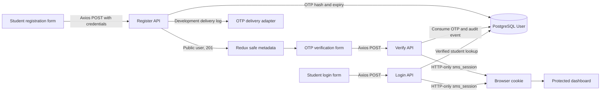

# Student Authentication and OTP Registration

## BRS/SRS summary

Students can register with a name, email, student ID, and password; verify a six-digit OTP; resend an OTP when eligible; and sign in after verification. Student accounts always use role `0`. Staff authentication and password reset are outside this feature.

The registration flow creates an inactive authentication state at the application level (`isVerified=false`) and sends the user to OTP verification. Verification consumes the OTP and creates the existing `sms_session` HTTP-only session. Login creates the same session only for an active, verified student.

## System boundaries

### API

| Method | Endpoint | Success | Client response |
| --- | --- | --- | --- |
| POST | `/api/auth/student/register` | 201 | `{ user, message }` |
| POST | `/api/auth/student/verify` | 200 | `{ user, message }` and `sms_session` cookie |
| POST | `/api/auth/student/resend` | 200 | `{ message }` |
| POST | `/api/auth/student/login` | 200 | `{ user, message }` and `sms_session` cookie |

The UI calls these endpoints through `AxiosInstance`, which uses JSON headers and `withCredentials: true`. Public user metadata is limited to `id`, `email`, `name`, `studentId`, `role`, and verification status where returned. Passwords, password hashes, OTPs, and session values do not cross into Redux or API response bodies.

### UI

- `/student/register` submits registration and redirects to `/student/verify?email=...`.
- `/student/verify` submits the OTP, supports resend, and redirects to `/dashboard` after verification.
- `/student/login` submits credentials and redirects to `/dashboard` after login.
- Stable API codes are translated into display-safe messages. `ACCOUNT_UNVERIFIED` redirects the user from login to the verification route.

## Lifecycle and error behavior

Email is trimmed and lowercased by the API. Student ID uniqueness and normalized email uniqueness are checked before creation, with database unique constraints as the final race-safety boundary.

OTP values are six digits, HMAC-hashed before persistence, valid for 10 minutes, single-use, limited to five failed attempts, and replaced on resend. Resend has a 60-second cooldown and resets attempts. The API uses these stable error codes: `VALIDATION_ERROR`, `INVALID_OTP`, `OTP_EXPIRED`, `INVALID_CREDENTIALS`, `ACCOUNT_UNVERIFIED`, `STUDENT_NOT_FOUND`, `IDENTITY_EXISTS`, `ALREADY_VERIFIED`, `OTP_ATTEMPTS_EXCEEDED`, `OTP_RATE_LIMITED`, and `INTERNAL_ERROR`.

All API errors use `{ error, code, details? }`. The Redux thunks preserve these codes at the Axios boundary, and the auth slice stores only safe display/error state and public identity metadata. A successful registration does not authenticate the student; verification or login is required.

## High-level data flow

## Persistence and provider assumptions

Migration `20260817090000_student_auth_otp` adds nullable `studentId` and OTP fields to `User`; `isVerified` defaults to `true` so existing staff accounts retain behavior. The migration is checked in but is **not applied in this environment**: the configured Docker database hostname is unavailable from the host, and the localhost override reached PostgreSQL but paused for baseline confirmation. Apply it through the normal Docker-network migration workflow or an explicitly confirmed project database workflow before exercising the feature against a real database.

OTP delivery currently logs the code server-side outside production. Production intentionally throws until an explicit email/SMS provider adapter is configured. No speculative infrastructure or provider integration is included here.

## Verification

- Student API Jest suite: 6 tests passed.
- Student Redux/Axios contract suite: 5 tests passed, including all endpoint paths, registration/verification payloads, resend success and rate-limit propagation, safe state, and unexpected-status fallback handling.
- Full existing authentication test suite: 48 tests passed as reported by the API/UI implementation phase.
- Typecheck, Prisma validation, and Prisma client generation passed as reported by the implementation phase.
- Browser/Playwright testing was not added; it is optional for this integration phase.

Remaining environment limitation: the migration still needs to be applied against an available database before production-like persistence testing. Production OTP delivery also requires a configured provider adapter.