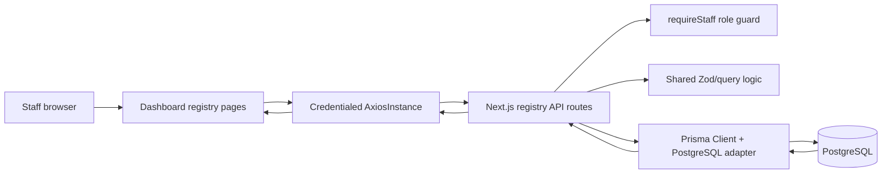

# Student and Programme Registry

## Business Requirements Summary

The registry gives staff a controlled catalogue of programmes and a searchable student directory. It supports safe read access, registrar-managed creation and updates, and administrator-managed archival or withdrawal. Search, filtering, sorting, pagination, detail inspection, lifecycle status, and soft deletion are in scope.

Enrolment, capacity, attendance, scheduling, payments, notifications, and staff administration are out of scope. Payment workflows remain responsible for `hasOverdueBalance` updates.

## System Requirements Summary

- Staff and above can list and inspect active students and programmes.
- Registrar and admin roles can create and update records.
- Admin only can soft-delete records.
- Student records accept a unique registry UID, normalized email, optional date of birth, academic year, status, programme link, and optional student-user link.
- Programme records accept a unique name, non-negative monetary values, optional coupon and discount limit, and status.
- List endpoints support `page`, `pageSize` (maximum 100), `search`, `sort`, `order`, plus `status`; students also support numeric `programmeId`.
- Successful responses use `{ data }`; list responses also include `{ pagination }`. Errors use `{ error, code, details? }`.
- Programme money is serialized as strings to preserve decimal precision.
- Registry projections never select or return password hashes, OTP values, or session data.
- Withdrawn students and archived programmes are terminal. Deletes set the terminal status and `deletedAt` without deleting the database row or linked user.

## Data Model

`Programme` contains `id`, unique `name`, `fee`, `discount`, optional `coupon`, optional `discountLimit`, lifecycle `status`, timestamps, and nullable `deletedAt`.

`Student` contains `id`, unique `studentUid`, `fullName`, unique normalized `email`, optional `dateOfBirth`, optional `academicYear`, lifecycle `status`, persisted `hasOverdueBalance`, optional unique `userId`, optional `programmeId`, timestamps, and nullable `deletedAt`.

A student may reference one active programme and one existing student-role `User`. The relation is nullable so registry-only students and later account linking remain possible. Existing authentication fields and behavior on `User` are unchanged.

## API Boundary

Routes live under `app/api/students` and `app/api/programmes`:

- `GET /api/students` and `GET /api/programmes` list safe records.
- `POST` creates a record for registrar-and-above users.
- `GET /:id` returns a safe detail projection.
- `PATCH /:id` updates a record for registrar-and-above users.
- `DELETE /:id` soft-deletes as `WITHDRAWN` or `ARCHIVED` for admins.

Shared Zod schemas, status values, pagination parsing, terminal-status rules, safe Prisma selections, and programme decimal serialization are in `lib/registry.ts`. Authentication is enforced by `requireStaff()` using the existing session and integer role mapping: staff `1`, registrar `2`, admin `3`.

Validation failures return `400 VALIDATION_ERROR`. Missing records return `404 STUDENT_NOT_FOUND` or `PROGRAMME_NOT_FOUND`. Duplicate identities return `409 STUDENT_EXISTS` or `PROGRAMME_EXISTS`; invalid terminal transitions return `409 INVALID_STATUS_TRANSITION`. Authentication and authorization use the existing `401 UNAUTHORIZED` and `403 FORBIDDEN` envelopes.

## UI Boundary

The dashboard pages are `/dashboard/students` and `/dashboard/programmes`. `RegistryPage` uses the shared credentialed `AxiosInstance` and reads list data from `response.data.data` and `response.data.pagination`; detail and mutation data come from `response.data.data`.

The UI provides search, status filters, supported sort controls, pagination, loading and empty states, safe detail display, create/edit forms, archive actions, and role-aware controls. Form values for monetary fields and numeric IDs are converted before submission. API errors are surfaced through accessible alerts.

Programme assignment currently uses a numeric programme ID because this feature has no programme lookup endpoint. This is coherent with the current API and can later be replaced by a safe lookup control without changing the student relation contract.

## Permissions

| Operation | Staff | Registrar | Admin | Student |
| --- | --- | --- | --- | --- |
| List/detail | Allow | Allow | Allow | Deny |
| Create/update | Deny | Allow | Allow | Deny |
| Soft-delete | Deny | Deny | Allow | Deny |

## Migration and Provider Assumptions

Migration `20260817120000_student_programme_registry` adds the student and programme enums, tables, indexes, unique constraints, and nullable foreign keys. It is additive and preserves existing `User` and `UserLog` records.

The project uses PostgreSQL through Prisma 7 and the `@prisma/adapter-pg` driver adapter. The migration must be applied and PostgreSQL must be reachable before the pages can load real records. Code validation does not require a live database; the current environment previously could not reach the configured database host.

## Verification

- Focused registry API tests: **4 suites, 23 tests passed**.
- Covered list search/filter/sort/pagination and response envelopes.
- Covered detail and update flows for both resources.
- Covered create validation, normalized fields, duplicate conflicts, missing active programme, and invalid filters.
- Covered terminal status transitions and soft deletion.
- Covered staff/registrar/admin permission boundaries.
- Covered safe projections with no password or other authentication secrets.
- Previously verified by the API/UI phases: `npm run typecheck`, `npx prisma validate`, `npx prisma generate`, and `git diff --check`.
- Browser/Playwright tests were not added because the repository Jest setup is Node-based and browser testing is optional for this phase.

## High-Level Data Flow

