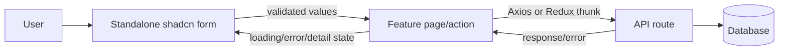

# Forms Structure Snapshot

## Before Refactor

Form implementations lived under `components/forms`. Three files contained multiple independent forms:

| Module | Previous file | Forms | Validation and flow |
| --- | --- | --- | --- |
| Assessment | `assessment-forms.tsx` | `AssessmentForm`, `GradeForm` | React Hook Form + Zod; assessment page posts/patches assessments and posts results through Axios |
| Assessment submission | `assessment-submission-form.tsx` | `AssessmentSubmissionForm` | React Hook Form + Zod; uploader updates assessment Redux state, page submits the stored file path |
| Enrollment | `enrollment-forms.tsx` | `EnrollmentForm`, `PaymentForm` | React Hook Form + Zod; enrollment page calls enrollment/payment Redux thunks and preserves dialog state |
| Registry | `registry-forms.tsx` | `StudentRegistrationForm`, `StudentRegistryForm`, `ProgrammeRegistryForm` | React Hook Form + Zod; registry page dispatches registration, save, reload, and detail flows |
| Authentication | individual files | `StudentLoginForm`, `StudentRegistrationForm`, `StudentOtpForm`, `StaffAccountForm` | React Hook Form + Zod; auth actions dispatch auth thunks and navigate or resend OTP |
| Payment | individual file | `PaymentForm` | React Hook Form + Zod; payment page dispatches `createPayment` and closes the dialog |

All forms used shadcn field primitives (`FieldGroup`, `Field`, `FieldLabel`, `FieldDescription`) and module-owned callbacks for submission, loading, cancellation, and server errors.

## After Refactor

Canonical implementations are one form per file under `components/ui/forms`:

- `assessment-form.tsx`
- `grade-form.tsx`
- `assessment-submission-form.tsx`
- `enrollment-form.tsx`
- `payment-form.tsx`
- `student-account-registration-form.tsx`
- `student-login-form.tsx`
- `student-otp-form.tsx`
- `staff-account-form.tsx`
- `student-registry-registration-form.tsx`
- `student-registry-form.tsx`
- `programme-registry-form.tsx`

`common-form.tsx` owns the repeated form mechanics: `react-hook-form` submit binding, shadcn `FieldGroup`, server error rendering, validation error rendering, and reusable submit/cancel actions. It does not own module state, API calls, Redux dispatches, or navigation.

The old `components/forms/*` paths are compatibility re-export barrels. Existing consumers remain valid, while module pages now import the canonical standalone files directly.

## Preserved Data Flow

- Assessment forms preserve assessment CRUD, grading, and upload-state behavior.
- Enrollment and payment forms preserve Redux/Thunk orchestration and dialog lifecycle.
- Registry forms preserve registration, programme/student save, reload, and archive flows.
- Authentication forms preserve auth thunk dispatch, OTP verification/resend, and navigation.
- Validation schemas, default values, field IDs, labels, error messages, and callback contracts remain module-compatible.
